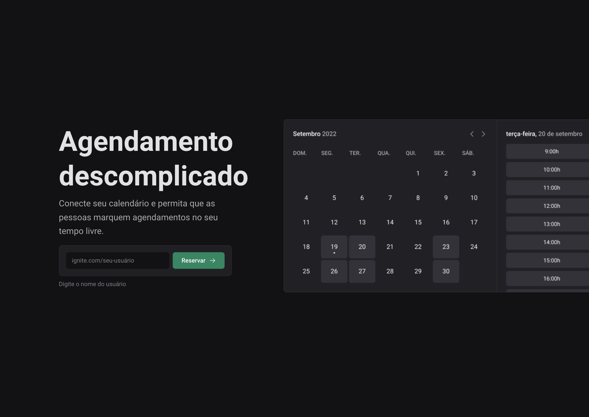

# Ignite Call



Aplicação de agendamento de compromissos desenvolvida com Next.js no bootcamp Ignite da Rocketseat. Inspirada no Calendly, permite que usuários se autentiquem com a conta Google, definam disponibilidade e compartilhem um link para agendamentos diretamente no Google Calendar.

> 🔗 Repositório original:  
> https://github.com/iamfelipy/2024-rocketseat-reactjs/tree/main/7-aprofundando-em-nextjs  
> 🌐 Deploy:  
> https://nextjs-ignite-call-agendamento.vercel.app

## 💻 Funcionalidades

- Login com conta Google (OAuth)
- Conexão e integração com o Google Calendar
- Geração de um link do google meet associado ao evento
- Escolha de dias e horários disponíveis
- Compartilhamento de link público para agendamento
- Criação de eventos no Google Calendar com envio automático de convite
- Armazenamento de dados em banco de dados PostgreSQL Serverless
- Interface moderna com validação de formulários

## 🚀 Tecnologias

- [Next.js](https://nextjs.org/)
- [React](https://react.dev/)
- [TypeScript](https://www.typescriptlang.org/)
- [Next Auth](https://next-auth.js.org/) – Login com Google
- [Google APIs](https://github.com/googleapis/google-api-nodejs-client)
- [Prisma ORM](https://www.prisma.io/)
- [React Hook Form](https://react-hook-form.com/) + [Zod](https://zod.dev/) – Validação de formulários
- [React Query](https://tanstack.com/query)
- [Day.js](https://day.js.org/)
- [Axios](https://axios-http.com/)
- [Docker](https://www.docker.com/)

## 🎨 Design (Figma)

- Layout oficial fornecido pela Rocketseat via Figma:  
[Figma - Ignite Call (Community)](https://www.figma.com/design/cf1hU9cvv3Vy859QoKAl94/Ignite-Call--Community-?node-id=0-1&p=f&t=CLKZLhizjJNdm3Tm-0)

## ▶️ Como Executar Localmente

Clone o repositório, configure o ambiente e execute o projeto:

```bash
# Clone o projeto
git clone https://github.com/seu-usuario/seu-repositorio.git
cd ignite-call

# Copie as variáveis de ambiente
cp .env.example .env.local

# Instale as dependências
npm install

# Inicie o servidor
npm run dev
```

Acesse `http://localhost:3000` para ver a aplicação.

> ⚠️ Para funcionar corretamente, você precisa configurar:
> - As credenciais do Google OAuth
> - As permissões de acesso à API do Google Calendar
> - A URL do banco de dados PostgreSQL no `.env.local`

## 📝 Licença

Este projeto está licenciado sob a licença MIT.
